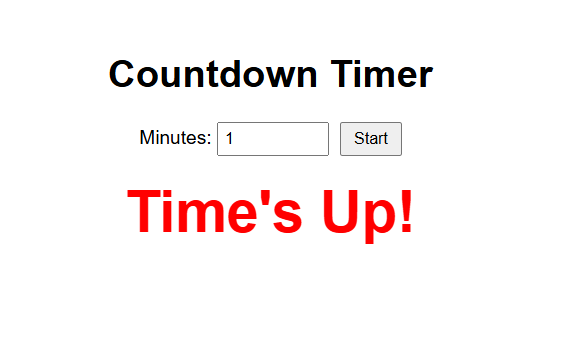

# ⏱️ Countdown Timer

A **countdown timer** built with **HTML, CSS, and JavaScript**.  

Enter the number of minutes, start the timer, and when the time runs out, it shows **"Time's Up!"** on the screen.
---

## 🚀 Features

- Enter minutes to start the countdown  
- Timer displays **minutes and seconds**  
- Text changes to **"Time's Up!"** when timer ends   

---

## 📸 Screenshot

  

---

## 🎬 Demo

You can see the demo live [here](www.)

---

## 🛠️ How to Run Locally

---

💻 Tech Stack
HTML 

CSS

JavaScript 

---

⚡ Usage

Enter the number of minutes in the input box.

Click Start to begin the countdown.

Watch the timer decrease.

When it reaches zero, "Time's Up!".

---

📂 Folder Structure

countdown-timer/
├── index.html       
├── style.css        
├── script.js        
├── screenshot.png   
└── README.md       

---

✍️ Author
Dinesh Singh Dhami

GitHub:  [thecodingdhami](https://github.com/thecodingdhami)

Portfolio: [dineshsinghdhami.com.np](http://dineshsinghdhami.com.np/)

---

🌟 Contributing
Feel free to fork this project, make improvements, and submit pull requests!

---

Made with ❤️ by Dinesh Singh Dhami
